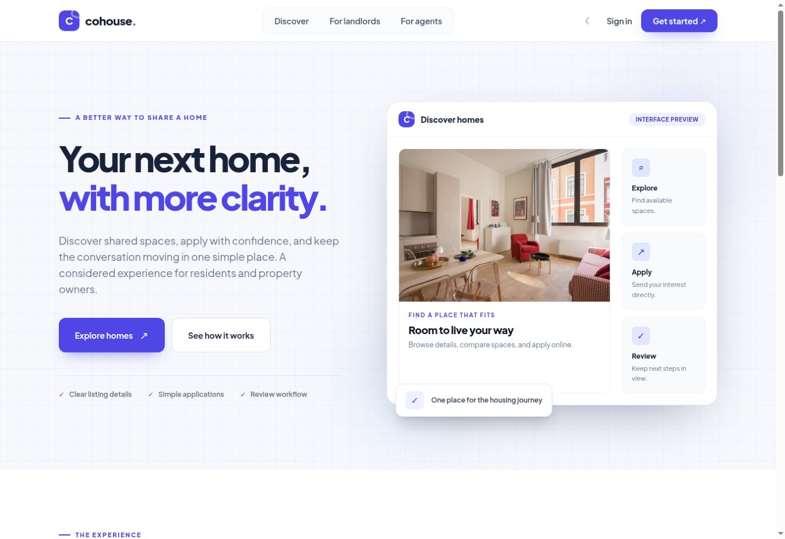
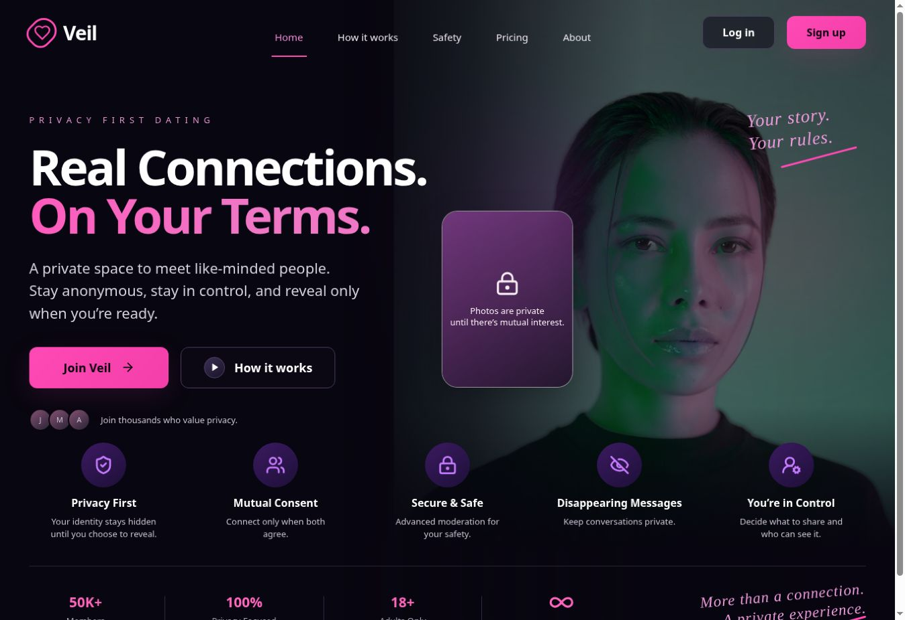

# Dev Yemsquare
### Software Engineer · Backend Systems · Applied AI

Building APIs, workflows, and web products that solve practical problems.

**Python / Django / FastAPI · PostgreSQL · React · Docker**

[Portfolio](https://yemsquare-portfolio.vercel.app/) &nbsp; / &nbsp; [LinkedIn](https://www.linkedin.com/in/yemsquare6/) &nbsp; / &nbsp; [Email](mailto:ibiyemioluyemi@gmail.com)

Lagos, Nigeria · Open to remote engineering roles and product collaborations

---

## Engineering with a purpose

I'm **Oluyemi Ibiyemi John**, a backend-focused software engineer working across API development, business systems, cloud deployments, and AI-assisted workflows.

My work spans shared-housing platforms, privacy-focused social products, customer support automation, and internal business applications. I also bring hands-on experience with WordPress and WooCommerce, third-party integrations, technical SEO, and production support.

I care about what happens beyond the interface: how data moves, who can access it, how failures are handled, and how the next engineer will maintain the system.

## Selected work

| Product | What I built |
| :--- | :--- |
|  | **Refund Desk · Customer support automation**  A containerized refund application with customer and support interfaces, deterministic policy checks, AI-assisted claim interpretation, human escalation, and decision audit trails. Includes **34 passing API and policy tests**. The walkthrough uses synthetic data and demo mode; live OpenAI integration requires an API key.  **React · FastAPI · SQLite · OpenAI · Docker Compose**  [Source code](https://github.com/Yemsquare/worknoon) · [Video walkthrough](https://drive.google.com/file/d/1HhrBuTxryr8iU60S-Zk-2CNJadI5UVGl/view?usp=sharing) |
|  | **CoHouse AI · PropTech**  A shared-housing product bringing property discovery, listing review, applications, and role-based experiences into one workflow. Backend development includes Django REST APIs and backend-managed Gemini integration.  **React · Django REST Framework · PostgreSQL · Gemini · Docker**  [Visit website](https://co-house-ai.vercel.app/) |
|  | **Veil · Privacy-first social discovery**  A web product for consenting adults, with work across anonymous profiles, controlled photo access, mutual identity reveals, messaging, and moderation workflows.  **Next.js · TypeScript · Django · PostgreSQL · Redis · Channels**  [Visit website](https://veil-web-gamma.vercel.app/) |

[Explore more projects →](https://yemsquare-portfolio.vercel.app/#portfolio)

## Technical toolkit

| Area | Technologies and experience |
| :--- | :--- |
| **Backend & APIs** | Python, Django, Django REST Framework, FastAPI, PHP, CakePHP, REST API design, authentication and role-based access |
| **Data & asynchronous work** | PostgreSQL, MySQL, SQLite, Redis, Celery, Django Channels |
| **Frontend** | React, Next.js, JavaScript, TypeScript, HTML, CSS, Tailwind CSS |
| **Applied AI & automation** | OpenAI and Gemini integrations, structured model outputs, RAG and embeddings, Make, Zapier, Google Apps Script |
| **Cloud & delivery** | Docker, Docker Compose, Git, GitHub Actions, Linux, DigitalOcean, Google Cloud, Render, Vercel |
| **Commerce & web platforms** | WordPress, WooCommerce, custom plugins, payment integrations, performance optimization, technical SEO |
| **Additional experience** | Android development with Java, TensorFlow, Keras, speech emotion recognition |

## How I approach engineering

- **Model the business rules first.** Make decisions explicit, testable, and easy to trace.
- **Design access deliberately.** Keep authentication, authorization, ownership checks, and secret management central to the implementation.
- **Treat AI as one part of the system.** Validate model outputs, enforce policy in application code, and provide fallbacks and human review.
- **Build for handover.** Document setup, API behavior, architecture, and implementation trade-offs.
- **Verify the important paths.** Use automated tests, reproducible environments, and deployment checks to catch meaningful failures.

## Let's build something useful

I'm interested in **backend engineering**, **API platforms**, **PropTech**, and **AI-enabled business workflows**. I also collaborate on automation and commerce projects where solid engineering can remove operational friction.

Have a role, a product, or a difficult integration in mind?  
**[ibiyemioluyemi@gmail.com](mailto:ibiyemioluyemi@gmail.com)** · [LinkedIn](https://www.linkedin.com/in/yemsquare6/) · [Portfolio](https://yemsquare-portfolio.vercel.app/)

---

“I build in silence, ship with intention, and let results speak.” 
Dev.Yemsquare

